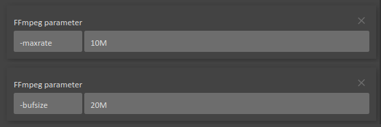

# Transcoding to MP4 / h.264

Transcoding to mp4 using h.264 has been made very easy and efficient with *DuME*, and most of the time you should not need to use advanced parameters. But it some cases, you may want to adjust these settings. These are some advices to have the best quality with the smallest possible files, and fix compatibility issues with specific players.

You can read more details in the [FFmpeg wiki](https://trac.ffmpeg.org/wiki/Encode/H.264).

[TOC]

## Quality settings

Most of the time, you **should not need to set the *bit rate* by yourself**. It is easier and better to use the quality slider to set a target quality, unless for technical reasons you need a specific average bitrate or a constant bit rate.

The ***quality slider*** is the most important parameter, which will adjust the quality vs the output file size. Setting the slider to more than 50% should output a good quality video, but if you need a perfect encoding, you can go higher than 75%.  
Setting the quality to 100% will be lossless, but be careful as this is not standard with h.264 and the file may not be played correctly with the majority of players.

The ***speed*** setting will provide a certain encoding speed to compression ratio. A slower encoding will provide better compression (compression is quality per filesize). This means that, for example, if you target a certain bit rate, you will achieve better quality with a slower preset. Similarly, when using the quality setting, you will simply save bit rate by choosing a slower encoding.  
Just use the slowest setting that you have patience for.

 You can optionally use the ***fine tuning*** to adjust the encoding settings based upon the specifics of your input. Current tunings include:

- Film – use for high quality movie content; lowers deblocking
- Animation – good for cartoons; uses higher deblocking and more reference frames
- Grain – preserves the grain structure in old, grainy film material
- Slide show – good for slideshow-like content
- Fast Decode – allows faster decoding by disabling certain filters
- Streaming (low latency) – good for fast encoding and low-latency streaming

For example, if your input is animation then use the animation tuning, or if you want to preserve grain in a film then use the grain tuning. If you are unsure of what to use or your input does not match any of tunings then omit the *Fine tune* option.

## Compatibility

To fix compatibiliy issues with some players, you may need to change the profile and level. Please refer to the documentation of the players you need to be compatible.

- **Baseline**: Primarily for lower-cost applications with limited computing resources, this profile is used widely in videoconferencing and mobile applications.
- **Main**: Originally intended as the mainstream consumer profile for broadcast and storage applications, the importance of this profile faded when the High profile was developed for those applications.
- **High**: The primary profile for broadcast and disc storage applications, particularly for high-definition television applications (this is the profile adopted into HD DVD and Blu-ray Disc, for example).
- **High 10**: Going beyond today’s mainstream consumer product capabilities, this profile builds on top of the High Profile, adding support for up to 10 bits per sample of decoded picture precision.
- **High 4:2:2**: Primarily targeting professional applications that use interlaced video, this profile builds on top of the High 10 Profile, adding support for the 4:2:2 chroma subsampling format while using up to 10 bits per sample of decoded picture precision.
- **High 4:4:4**: This profile builds on top of the High 4:2:2 Profile, supporting up to 4:4:4 chroma sampling, up to 14 bits per sample, and additionally supporting efficient lossless region coding and the coding of each picture as three separate color planes.

!!! Note
    To improve compatibility, *DuME* sets the pixel format to YUV 4:2:0 (12 bits / 8 bpc) for h264, as most of the players won't play 4:2:2 or 4:4:4 (even at 8 bpc). When using high profiles, you will also need to change the pixel format accordingly.

## Constrained encoding (VBV / maximum bit rate)

Use this mode if you want to **constrain the maximum bitrate used**, or keep the stream's bitrate within certain bounds. This is particularly useful for online streaming, where the client expects a certain average bitrate, but you still want the encoder to adjust the bitrate per-frame.

Add two custom parameters:

- `-maxrate` sets the maximum bitrate. Add `M` to the value to specify it in Mbps.
- `-bufsize` is the "rate control buffer", so it will enforce your requested "average" bitrate across each 20 MBit (it this example) worth of video. Here it is assumed that the receiver / player will buffer that much data, meaning that a fluctuation within that range is acceptable. 

## FAQ

### Does *DuME* support multi-pass encoding?

No. Read the next question for more details.

### Would two-pass provide a better quality?

​No, though it does allow you to target a file size more accurately. Nowadays, most users don't need this, but if you need it for technical reasons, just get in touch and it may be implemented.

### Why doesn't my lossless output look lossless?

When setting the quality to 100%, the output should be lossless. But if your input files are RGB, it's the RGB to YUV color space conversion. You may output RGB h264 but be careful as this is not standard at all.